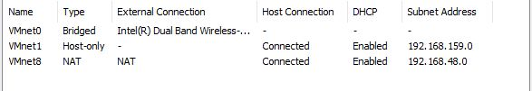

# Wake on Lan Project

### Assigments

- Connect two Raspberry Pi to comnetsemu assuming they are servers connecred to the SDN netowork,.
- Simulate allocation of container requests with tasks to perform
- Depending on load (e.g., max 2/3 containers per RPi) turn on/off RPi and start the container
- When a container is done , if no other container is running switch the RPi off.

### Configurations

- Two Raspberry Pi ( we have used Raspberry Pi 3).
- Comntesemu VM with mininet, where run the server.
- Computer where run the client.

Since wake on LAN is not supported by Raspberry Pi, we have simulated it in this way : the raspberry is always on , and when it starts , it automatically runs a python script, called sniffer.py . This script simulates the wake on LAN : it always waits for a magic packet to be sent to it ; if it receives a magic packet (WOL) , it launches server.py (we use server.py to simulate the turn on/off of the raspberry, if this script is running it means that the raspberry is on, otherwhise it's not).

Since our goal was to use a SDN network, and using a SDN network with real hosts without a SDN router is not possible, we had to use a virtual network (mininet network that runs over comnetsemu VM).

## Setup

We have configured the setup of this project in this way because we want to simulate as much as possible a wake on LAN and a SDN envoirment.

### Raspberry

In order to automatically configure so that the sniffer.py starts  when the the raspberry turns on :

`sudo nano /etc/xdg/lxsession/LXDE-pi/autostart`

edit this file and add at the end :

`@sh "PATH di launch.sh"`

if you have problems with the terminal (it opens and closes immediately), you could try to add `;bash` inside sniffer.py:

`"lxterminal -e 'sudo python3 /home/pi/Desktop/next2022/server.py ;bash'"`

so you can see which error you have.

When you have solved all your problems, delete `;bash`

### Server

Download the comnetsemu virtual machine for VMware (no version 17).

Configure the network settings :

- in the comnetsemu VM settings add a network adapter (2) 
- edit the NAT settings of the network adapter 1  
- configure the port forwarding to enable ssh : 2222->22 
- configure the second network adapter as a bridge, and set the eth0 IP that you can see on the terminal (using ifconfig)
- Every time you turn on the pc open the Virtual Network Editor **as admin** 

### Client

Configure in gui.py the right IP of your machine where is running the hostServer.py

In all the devices if you want to solve your ip address with some hosts names you can modify their local file "hosts".
